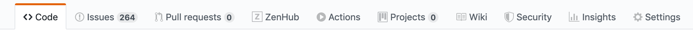

# Project

A unified [scrum or kanban board](https://github.com/mojaloop/project#zenhub) for tracking issues across all Mojaloop Projects.

## Can't see the Scrum Board?

This repo relies on the [Zenhub Browser Extension](https://www.zenhub.com/extension) in order to see Github issues in a scrum board.

You should be able to see the _"ZenHub"_ tab in the top bar. If not, go through the following steps to see the kanban board:

> _Note:_ In order to add __mojaloop__ to your Zenhub workspaces, you need your Github account be added to the Mojaloop project. If you believe you should be added, contact us on the [Mojaloop Slack](mojaloop.slack.com).

1. Go to the [Zenhub Login Page](https://app.zenhub.com/login) and log in to Zenhub with your Github account
2. Connect your new Zenhub account with the Mojaloop Organisation, Search for the _'project'_ workspace
3. Install the [Zenhub Browser extension](https://www.zenhub.com/extension) for Chrome or Firefox, and reload this page. You should now see the following: 

## Templates, Labels and Pipelines
1. Please use the available templates for bugs or feature requests (epics, stories). There are [templates for bugs and stories](https://github.com/mojaloop/project/issues/new/choose).
2. Please use appropriate labels as applicable (epic or story) along with the work-stream that it belongs to (example: 'oss-core' for core related issues, 'oss-ver' for versioning work-stream, 'oss-perf' for performance work-stream and so on.)
3. The pipelines are intended to give a view of the movement of stories and epics.  
3.1. **Product Backlog Epics** - All Epics that span more than one Program Increment (PI) are included under this pipeline as long as they're active. 
3.2. **Product Backlog** - All stories, bugs are included in this by default if they cannot be assigned to the current or a particular PI. 
3.3. **PI Backlog Epics** - All Epics that span a single (PI) and are prioritized for the current PI are included under this pipeline until they're closed. 
3.4. **PI Backlog** - All stories, bugs are included for the current PI are included in this until they're prioritized for a particular Sprint. 
3.5. **Sprint Backlog** - Once stories, epics are prioritized for a Sprint by a work-stream, they can be moved to the Sprint backlog. 
3.6. **Blocked** - Stories, bugs relevant to the current PI and are blocked because of an immediate work-item/issue are present in this pipeline. 
3.7. **In Progress** - All issues that are currently being worked on are present in this pipeline. Ideally by now all stories, bugs should have an assigned milestone, an estimate, an Epic, proper labeling and acceptance criteria. 
3.8. **Review** - Stories, bugs once completed and ready for review are moved to this pipleline to be reviewed by Product Owner, etc. before moving to the closed pipleine. 
3.9. **Closed** - All Epics, Stories, bugs once completed are moved to the Closed pipeline (issues closed by default are also moved to this). 
